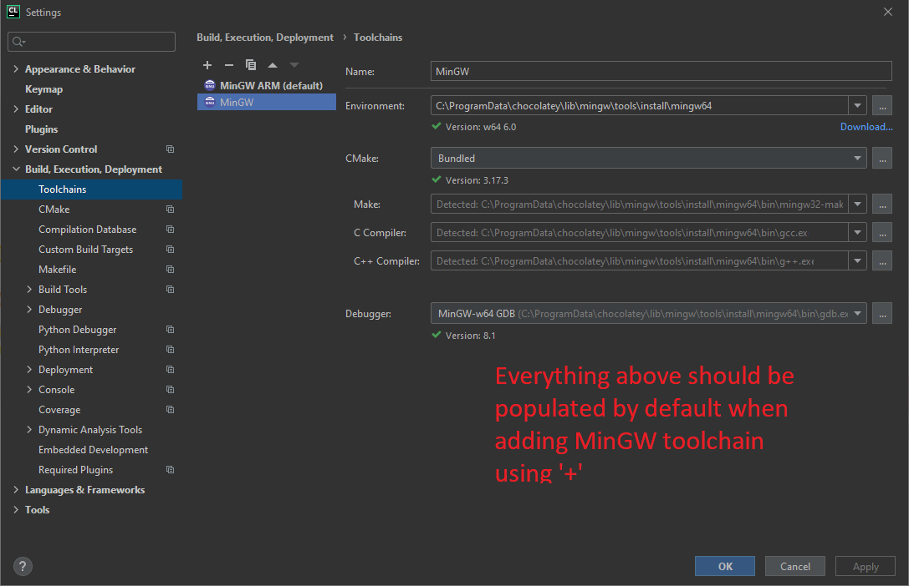
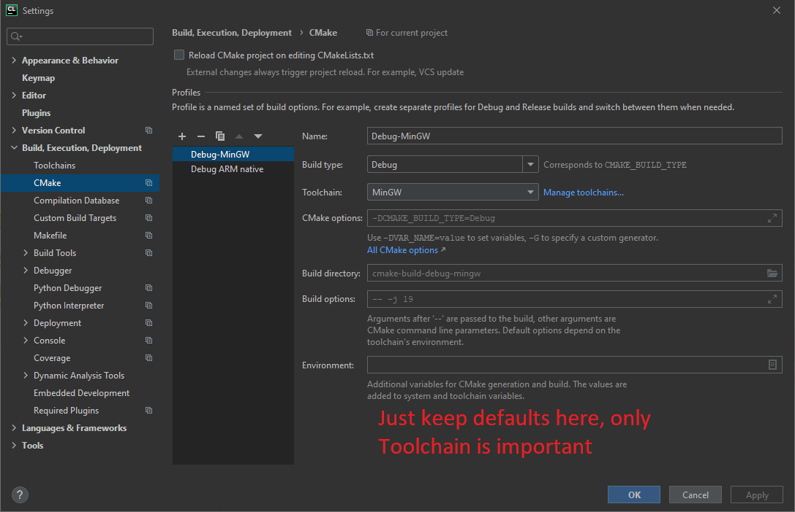
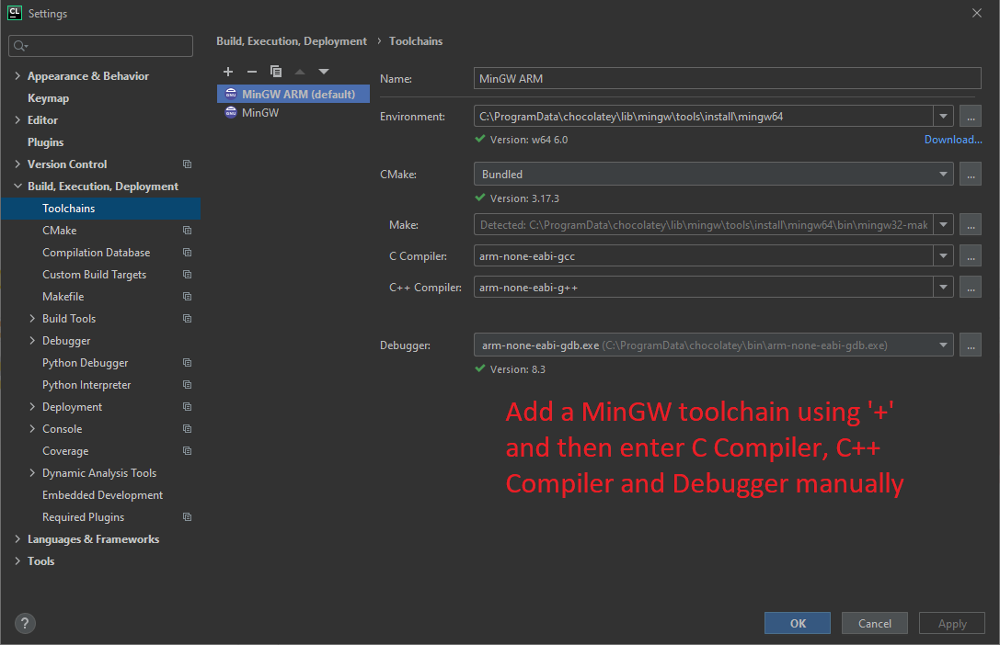
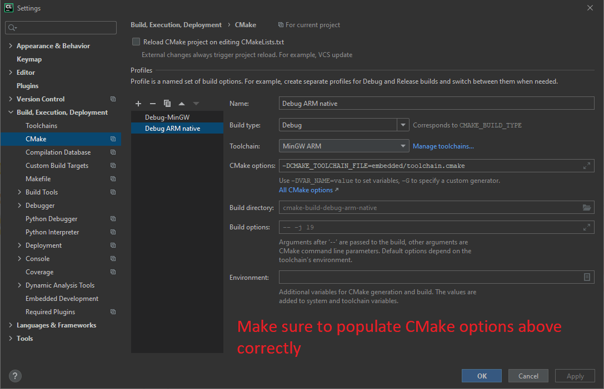
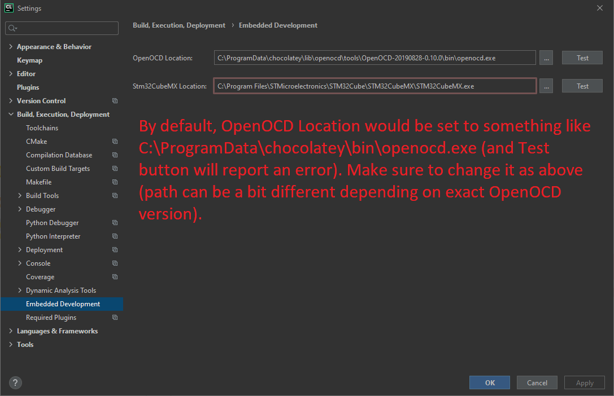
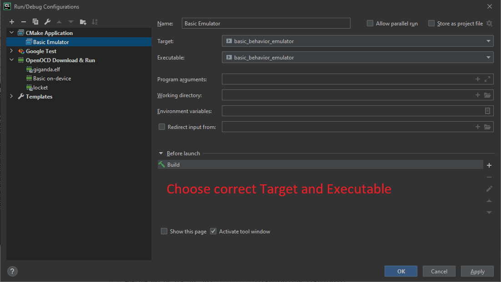
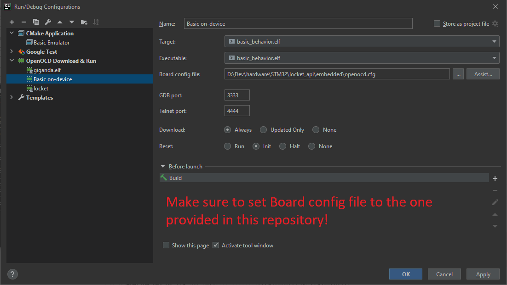

# Locket 
Firmware for the Locket Project ([Russian description](https://ostranna.ru/gamedesign/locket), [English description](https://ostranna.ru/?lang=en)).

Corresponding hardware project is [here](https://github.com/Kreyl/Locket_hw/).

Locket is a device for LARPs. It has stm32 microcontroller, 868 MHz radio, buttons, vibro, RGB led, beeper and accelerometer. It is placed in nice 3d-printed case. Locket may be used for rather complex game-design. It is powered by two AAA batteries. 

## Software prerequisites

* Windows. All software used is cross-platform, though. But you will need to figure out how to install it on your own. 
* [Chocolatey](https://chocolatey.org/). Package manager for Windows. Things below *can* be installed without it,
  but then it's up to you to figure out how.
* MinGW. Install by running `choco install mingw` from administrator command prompt.
* CLion. Not really essential, you can use editor of your choice + run cmake/openocd commands from the terminal. But
  that document assumes CLion usage. 

If you only need to work with a business logic and desktop emulator - that's it. If you want to be able to build the
firmware, flash it to device and debug on-device, following is also needed:
* ARM GCC Toolchain. Install by running `choco install gcc-arm-embedded` from administrator command prompt.
  To check that it's successfully installed, run `arm-none-eabi-gdb -v` - it must give you a version and not an error
  about missing file.
* OpenOCD. Install by running `choco install openocd` from administrator command prompt.
  To check that it's successfully installed, run `openocd -v` - it must give you a version and not an error
  about missing file. To check that it's compatible with your locket and ST-Link programmer - run
  `openocd -f interface/stlink.cfg -f target/stm32l1.cfg` while having your programmer and locket connected
  (and powered on by programmer button). It should output bunch of text ending in 
  *Listening on port 3333 for gdb connections*. See detailed guide [here](https://alicelarp.atlassian.net/wiki/spaces/HW/pages/790528004/OpenOCD)
  (in Russian).
  
### Setting up a CLion

Open this project using CLion and configure Toolchains and CMake profiles (needs to be once per machine):
For desktop/emulator-only setup:

For building final firmware, flashing and debugging on-device, also set up

and an OpenOCD configuration.

Now set up run configurations: 

You can now try running them to see if everything works correctly. You should be able to both Run and Debug them.